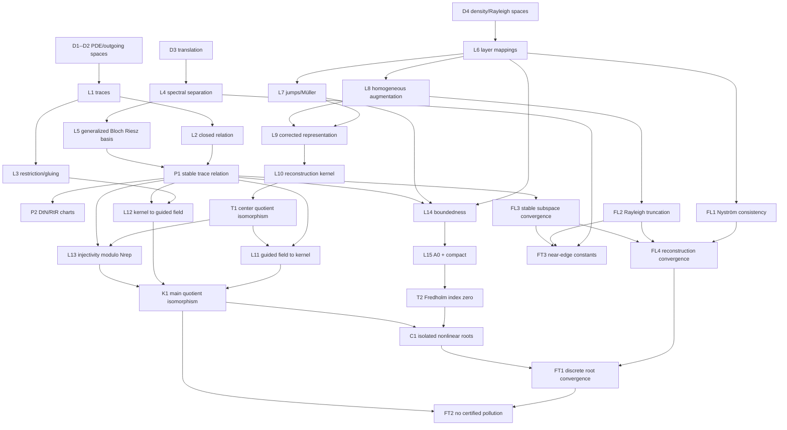

# Theorem dependency graph

## ASCII DAG

```text
D1,D2 --> L1 --> L2 ---------> P1 -----> L11 --+
   |       |                    ^                |
   |       +--> L3 <------------|-------> L12 --+--> L13 --> K1
   |                            |                |      ^
   +--> D3 --> L4 --> L5 -------+                |      |
                                                     T1-+
D4 --> L6 --> L7 --> L9 --> L10 --> T1 ----------------+
        |      ^      ^
        +--> L8 ------+

P1 --> P2                 (coordinate charts only)
L6,L7,P1,D5 --> L14 --> L15 --> T2 --> C1
K1 -------------------------------------> C1

L6,L7 --> FL1 --+
L8,L9 --> FL2 --+--> FL4 --> FT1 --> FT2
L4,L5,P1 --> FL3+             |
K1,T2,C1 ---------------------+
L4,FL2,FL3 ---------------------------> FT3
```

## Mermaid DAG



## LaTeX/TikZ source

The final report includes a compilable TikZ version. Its compact layer ordering is

```latex
\node (trace) {L1--L3: traces/gluing};
\node[right=of trace] (floquet) {L4--P1: stable generalized traces};
\node[below=of trace] (bie) {L6--T1: Müller--Rayleigh quotient};
\node[right=of bie] (couple) {L11--L13: coupled equivalence};
\node[right=of couple] (main) {K1};
\node[below=of couple] (fredholm) {L14--T2};
\node[right=of fredholm] (discrete) {FL1--FT3};
\draw[->] (trace)--(couple);
\draw[->] (floquet)--(couple);
\draw[->] (bie)--(couple);
\draw[->] (couple)--(main);
\draw[->] (main)--(fredholm);
\draw[->] (fredholm)--(discrete);
```

## Why every arrow exists

| Arrow group | Dependency reason |
|---|---|
| D1/D2→L1→L2 | Closedness is meaningful only after the trace spaces and weak conormal derivative are defined. |
| L1→L3 | Weak gluing requires matched Dirichlet/conormal traces in dual spaces. |
| D3→L4→L5→P1 | Stable modal synthesis requires a defined translation operator, a unit-circle-free Riesz contour, then complete generalized Jordan chains. |
| L2→P1 | The synthesized stable span must equal a closed physical outgoing relation, not merely be dense in an unspecified norm. |
| P1→P2 | DtN and RtR are projections/charts of the already-defined Cauchy subspace. |
| D4→L6→L7 | Müller jumps are bounded only on the correct density/trace spaces and with the layer mappings established. |
| L6/L7/L8→L9 | The representation needs valid layer operators, correct jumps, and the missing homogeneous sector. |
| L9→L10→T1 | Surjectivity alone does not yield an isomorphism; the reconstruction kernel must be identified and quotiented. |
| P1/T1→L11 | Completeness uses both center representation and stable lead coordinates. |
| L3/P1→L12 | Soundness uses port matching, outgoing lead reconstruction, and weak gluing. |
| T1/P1→L13 | Zero-field injectivity splits into center representation ambiguity and uniqueness of generalized trace coordinates. |
| L11/L12/L13→K1 | These are, respectively, surjectivity, well-defined sound reconstruction, and injectivity modulo `Nrep`. |
| L6/L7/P1/D5→L14 | Each row block derives its boundedness from layer, jump, and stable synthesis estimates. |
| L14→L15→T2 | A compact-perturbation Fredholm proof first needs a bounded square realization and an invertible reference operator. |
| K1/T2→C1 | Analytic Fredholm discreteness becomes physically meaningful only after algebraic kernels are identified with guided fields. |
| FL1/FL2/FL3→FL4 | Field reconstruction convergence combines boundary, homogeneous-mode, and stable-relation errors. |
| FL4/C1→FT1 | Root convergence needs operator/reconstruction convergence near isolated analytic characteristic values. |
| FT1/K1→FT2 | No certified pollution uses compactness of approximate roots plus the continuous field equivalence. |
| L4/FL2/FL3→FT3 | Edge constants deteriorate through modal decay, Rayleigh denominators, and invariant-subspace separation. |

